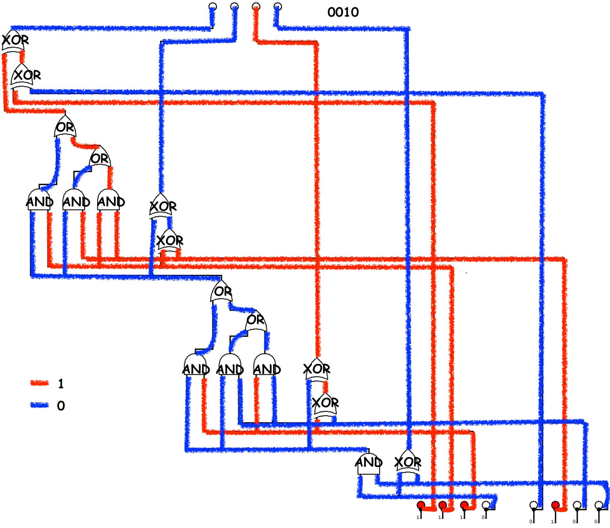

# Analyse

On a un circuit de portes logiques qu'on va simplement analyser pour trouver la sortie

# Résolution



Ce qui donne le flag :

```
FCSC{0010}
```

# Ressources
- [Wikipedia](https://fr.wikipedia.org/wiki/Porte_logique#D%C3%A9signation)